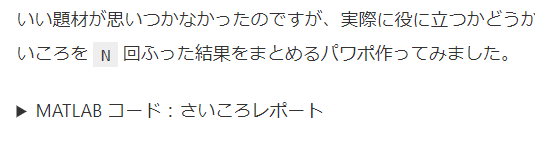

# はじめに
  


@aoimidori さんの [MATLABからCOTOHA APIをコールしてみた](https://qiita.com/aoimidori/items/644ac0e726d60a99cc4a) に刺激を受け、私も MATLAB から COTOHA API を試してみました。


  
> **CONOHA API とは：**構文解析、照応解析、キーワード抽出、音声認識、要約など、様々な**自然言語処理・音声処理API**を提供しているサービスです。**NTTグループの40年にわたる研究成果**である、日本語辞書や単語を3000種以上の意味性分類する技術などを活用し、高度な解析をAPIで手軽に利用できます。


  


ということですが、いろんな遊びができそう。できることが沢山あってそれぞれ試すだけでも面白いです。


@mosaosa さんの [我々のコミュニケーションには"雅"が足りない。](https://qiita.com/mosamosa/items/e63f6e582a206659dc2b) も秀逸。雅で柔軟な発想がすごいなぁと思いました。


私はそんな粋なアイデアが出てこないので、とりあえず COTOHA API の基本機能で遊んでみます。


  
# やったこと


まずは Qiita 記事の要約


  
## 実行環境

   -  MATLAB R2019b 
   -  Text Analytics Toolbox 


COTOHA API を使うまでの手順は @aoimidori さんの記事を参考にしてください。


# **0. アクセストークンを取得する**
```matlab
clientid = 'input_your_Client_ID';
clientsecret = 'input_your_Client_secret';

url = 'https://api.ce-cotoha.com/v1/oauth/accesstokens';
options = weboptions('RequestMethod','post', 'MediaType','application/json');
Body = struct('grantType', 'client_credentials', ... 
          'clientId', clientid, ...
          'clientSecret', clientsecret);
tokens = webwrite(url, Body, options);
```
# 1. Qiita 記事の読み込み


ここは Qiita API を使って自動化できそうですが、まずは URL から直接読み込んでみましょう。[テンプレート使って PowerPoint スライド作成自動化：MATLAB Report Generator 編](https://qiita.com/eigs/items/cb48fdcd741126d09def) を例に使ってみます。


```matlab
% テンプレート使って PowerPoint スライド作成自動化：MATLAB Report Generator 編
URL = 'https://qiita.com/eigs/items/cb48fdcd741126d09def';
source = webread(URL);
source(1:100) % 冒頭の 100 文字
```
```
ans = '<!DOCTYPE html><html><head><meta charset="utf-8" /><title>テンプレート使って PowerPoint スライド作成自動化：MATLAB Repo'
```


ソースから文章だけ取ってきます。ここで使うのは html からテキスト抽出する `extractHTMLText` 関数（[ヘルプページ](https://jp.mathworks.com/help/textanalytics/ref/htmltree.extracthtmltext.html)）


```matlab
sourceText = extractHTMLText(source);
sourceText(1:200)
```
```
ans = 
    'はじめに
     
     シゴトで、定期的にとある集計をパワポに纏めていたんですが、MATLAB でデータ集めて、グラフをコピペして・・など 30分程かかる作業が地味にめんどくさい。
     
     「まぁ、毎日やることじゃないし・・」と我慢してやっていましたが、2020年は 「退屈なことは MATLAB にやらせよう」ということで、一念発起して自動化。
     
     その際にはまった点と、PowerPoint テンプレートの使用例を紹'

```


ま、なんかよさそう。


# 2. COTOHA API 呼び出し


COTOHA API の[リファレンス](https://api.ce-cotoha.com/contents/reference/apireference.html)によると


> curl -X POST -H 'Content-Type:application/json;charset=UTF-8' -H 'Authorization:Bearer [Access Token]' -d '{"document":"前線が太平洋上に停滞しています。一方、高気圧が千島近海にあって、北日本から東日本をゆるやかに覆っています。関東地方は、晴れ時々曇り、ところにより雨となっています。東京は、湿った空気や前線の影響により、晴れ後曇りで、夜は雨となるでしょう。","sent_len":"1"}' [API Base URL]/nlp/beta/summary


という感じで使います。`sent_len` は要約を、いくつの文章で返すかのオプションのようです。必須の入力は `document` なので、ここに上で抽出した文章入れてみます。


  


POST なので webwrite 関数でいけますね。@aoimidori さんのコードをまねてみると・・


```matlab
baseurl = 'https://api.ce-cotoha.com/api/dev/';
Header = {'Content-Type', 'application/json;charset=UTF-8';
    'Authorization', ['Bearer ' tokens.access_token]};
Body = struct('document', sourceText, ... 
          'sent_len', '1');
options = weboptions('RequestMethod','post', ...
    'MediaType','application/json','HeaderFields', Header);

response = webwrite([baseurl 'nlp/beta/summary'], Body, options);
```


記事要約は・・


```matlab
string(response.result)
```
```
ans = "MATLAB コード：さいころレポート%% 事前設定% ファイル名に今日の日付を使いますreportDate = datetime; reportDate.Format = 'yyyy-MM-dd';% 関連ライブラリの読み込みimport mlreportgen.ppt.*;% 事前作成したテンプレートからスライド作成pres = Presentation(fileName,'sampleTemplate.potx');%% タイトルスライド作成% テンプレートにある "Title Slide" レイアウトを使用titleSlide = add(pres,'Title Slide');% ファイル名やタイトルfileName = "sampleReport" + string(reportDate);titleText = "サンプルレポート";subTitleText = "作成日" + string(reportDate);% プレースホルダの内容を入れ替えreplace(titleSlide,'Title',titleText);replace(titleSlide,'Subtitle',subTitleText);%% ここからレポートページ% さいころを N 回振って、出る目の回数を集計します。"
```
# 3. なんかおかしい：コードのせい


これはどうも記事に MATLAB コードが含まれているからですね。これは取り除きたい。


今度は HTML をパースするために `htmlTree` 関数（[ヘルプページ](https://jp.mathworks.com/help/textanalytics/ref/htmltree.html)）使ってみます。ソースを見ると、コードは `<div class="code-frame"> `で囲まれているみたいなので、


```matlab
tree = htmlTree(source);
```


でその中から、パラグラフ、ヘッダー、リストなど取ってきましょう。


```matlab
selector = "p,li";
subtrees = findElement(tree,selector);
subtrees(1:10) % ちょっとだけ表示
```
```
ans = 
  10x1 htmlTree:

    <P>シゴトで、定期的にとある集計をパワポに纏めていたんですが、MATLAB でデータ集めて、グラフをコピペして・・など 30分程かかる作業が地味にめんどくさい。</P>
    <P>「まぁ、毎日やることじゃないし・・」と我慢してやっていましたが、2020年は <STRONG>「退屈なことは MATLAB にやらせよう」</STRONG>ということで、一念発起して自動化。</P>
    <P>その際にはまった点と、PowerPoint テンプレートの使用例を紹介します。</P>
    <LI>MATLAB R2019b</LI>
    <LI>MATLAB Report Generator</LI>
    <P>今回は MATLAB Report Generator を使いますが <A href="https://jp.mathworks.com/matlabcentral/answers/99268-powerpoint" rel="nofollow noopener" target="_blank">COM サーバーを使う方法</A> に慣れていれば MATLAB だけでもできると思います。</P>
    <P>以前書いた <A href="https://qiita.com/eigs/items/8c4bf743fc1319762607" id="reference-e1a4b2e138fe2f4fffda">【MATLAB】PowerPoint スライド作成自動化</A> では、機械学習の評価結果を纏める作業を自動化しました。ただ、画像の位置などを試行錯誤して特定して、コード内に直書き。</P>
    <P>表示位置など変更の必要が無ければ特に困らないとは思いますが、メンテナンス的に残念な例ではありました。すいません。今回は少しだけ背伸びして、PowerPoint のテンプレートを使った例を紹介します。</P>
    <P>いい題材が思いつかなかったのですが、実際に役に立つかどうかは、皆さんの想像力次第・・ということで、さいころを <CODE>N</CODE> 回ふった結果をまとめるパワポ作ってみました。</P>
    <P><DETAILS><SUMMARY>MATLAB コード：さいころレポート</SUMMARY><DIV><DIV class="code-frame" data-lang="matlab"><DIV class="highlight"><PRE><SPAN class="c1">%% 事前設定</SPAN><SPAN class="c1">% ファイル名に今日の日付を使います</SPAN><SPAN class="n">reportDate</SPAN><SPAN class="o">=</SPAN><SPAN class="nb">datetime</SPAN><SPAN class="p">;</SPAN><SPAN class="n">reportDate</SPAN><SPAN class="o">.</SPAN><SPAN class="n">Format</SPAN><SPAN class="o">=</SPAN><SPAN class="s1">'yyyy-MM-dd'</SPAN><SPAN class="p">;</SPAN><SPAN class="c1">% 関連ライブラリの読み込み</SPAN><SPAN class="nb">import</SPAN><SPAN class="n">mlreportgen</SPAN><SPAN class="o">.</SPAN><SPAN class="n">ppt</SPAN><SPAN class="o">.*</SPAN><SPAN class="p">;</SPAN><SPAN class="c1">% 事前作成したテンプレートからスライド作成</SPAN><SPAN class="n">pres</SPAN><SPAN class="o">=</SPAN><SPAN class="n">Presentation</SPAN><SPAN class="p">(</SPAN><SPAN class="nb">fileName</SPAN><SPAN class="p">,</SPAN><SPAN class="s1">'sampleTemplate.potx'</SPAN><SPAN class="p">);</SPAN><SPAN class="c1">%% タイトルスライド作成</SPA…

```


`<div class="code-frame">` で囲まれたコードはなくなっていますが・・怪しいものがあります。


## 3.1 `<DETAILS>` ってなんだ


これはコードを折りたたむ表示にしているところですね・・





ここ。ここのコードが <p> 内に入ってきています。。結構にめんどくさくなってきた。


折りたたんでいなければ、ここまでの処理で十分なはず。


  


ちなみにこのまま実行すると


```matlab
sentence = extractHTMLText(subtrees);
sentence = join(sentence); 
Body = struct('document', sentence, ... 
          'sent_len', '1');
options = weboptions('RequestMethod','post', 'MediaType','application/json','HeaderFields', Header);
response = webwrite([baseurl 'nlp/beta/summary'], Body, options);
string(response.result)
```
```
ans = "names = ["one","two","three","four","five","six"];for ii=1:5 % 10回 から 10万回まで N = 10^ii; % 1 から 6 までの整数を生成 diceResults = randi(6,[N,1]); % それぞれの出目の回数を集計 counts = histcounts(diceResults); [countsSorted,idx] = sort(counts,'descend'); % ヒストグラムプロット作成 hFigure = figure(1); histogram(diceResults,'Normalization','probability'); title('Histogram of Each Occurenace'); ha = gca; ha.FontSize = 20; % 画像として保存して後に、パワポにコピー imgPath = saveFigureToFile(hFigure); pictureObj = Picture(imgPath); % スライドタイトル slideTitle = "Uniformly Distributed? (N = " + string(N) + ")"; % 事前に準備しておいた Custom レイアウトからページ作成 slide = add(pres, 'Custom'); replace(slide,'Title',slideTitle); % タイトル replace(slide,'Picture Placeholder Big', pictureObj); % 真ん中はヒストグラムを配置 % 出た回数順にトップ５：出た回数と画像を配置 topfive = names(idx); for jj=1:5 % 画像は事前に用意したものを使用 imagePath = "./images/" + topfive(jj) + ".png"; if ~exist(imagePath,'file') % 念のため画像がない場合 imagePath = "./images/a.png"; end pictureObj = Picture(char(imagePath)); replace(slide,"Picture Placeholder " + jj, pictureObj); replace(slide,"Text Placeholder " + jj, string(countsSorted(ii))); end % hFigure を閉じる if( isvalid(hFigure) ) close(hFigure); endend%% 以上のページをもとにパワポ作成% msgbox でダイアログ出してみるhMsg = msgbox('Generating PowerPoint report...');% pres を閉じておきます。"
```


と引き続き残念な感じになります。


## 3.2 地道に `<DETAILS>` 対策


ここはとにかく動けばいいということで、一個づつ `<DETAILS>` が入っちゃっているか確認して削除します。


```matlab
selector = "p,li";
subtrees = findElement(tree,selector);

% check if details contained in p
index = false(length(subtrees),1);
for ii=1:length(subtrees)
    tmp = findElement(subtrees(ii),'details');
    index(ii) = isempty(tmp); % <DETAILS> があれば false になる
end

% DETAILS 無し
subtreesNoDetails = subtrees(index);
subtreesNoDetails(1:10)
```
```
ans = 
  10x1 htmlTree:

    <P>シゴトで、定期的にとある集計をパワポに纏めていたんですが、MATLAB でデータ集めて、グラフをコピペして・・など 30分程かかる作業が地味にめんどくさい。</P>
    <P>「まぁ、毎日やることじゃないし・・」と我慢してやっていましたが、2020年は <STRONG>「退屈なことは MATLAB にやらせよう」</STRONG>ということで、一念発起して自動化。</P>
    <P>その際にはまった点と、PowerPoint テンプレートの使用例を紹介します。</P>
    <LI>MATLAB R2019b</LI>
    <LI>MATLAB Report Generator</LI>
    <P>今回は MATLAB Report Generator を使いますが <A href="https://jp.mathworks.com/matlabcentral/answers/99268-powerpoint" rel="nofollow noopener" target="_blank">COM サーバーを使う方法</A> に慣れていれば MATLAB だけでもできると思います。</P>
    <P>以前書いた <A href="https://qiita.com/eigs/items/8c4bf743fc1319762607" id="reference-e1a4b2e138fe2f4fffda">【MATLAB】PowerPoint スライド作成自動化</A> では、機械学習の評価結果を纏める作業を自動化しました。ただ、画像の位置などを試行錯誤して特定して、コード内に直書き。</P>
    <P>表示位置など変更の必要が無ければ特に困らないとは思いますが、メンテナンス的に残念な例ではありました。すいません。今回は少しだけ背伸びして、PowerPoint のテンプレートを使った例を紹介します。</P>
    <P>いい題材が思いつかなかったのですが、実際に役に立つかどうかは、皆さんの想像力次第・・ということで、さいころを <CODE>N</CODE> 回ふった結果をまとめるパワポ作ってみました。</P>
    <P/>

```
# 4. こんどこそ要約
```matlab
sentence = extractHTMLText(subtreesNoDetails);
sentence = join(sentence);
Body = struct('document', sentence, ... 
          'sent_len', '1');
options = weboptions('RequestMethod','post', 'MediaType','application/json','HeaderFields', Header);
response = webwrite([baseurl 'nlp/beta/summary'], Body, options);
string(response.result)
```
```
ans = "今回は少しだけ背伸びして、PowerPoint のテンプレートを使った例を紹介します。"
```


できた！！タイトルと合わせると内容とあっていますね。


# 5. 他の記事も要約


`getSummary` 関数にして（ソースはページ下記）他の記事にも試してみます。第三引数で要約文の数を指定するようにしました。


[**【MATLAB】機械学習アプリ上のプロットを再現したいんですが・・**](https://qiita.com/eigs/items/38e31027529f92233b27)


```matlab
URL = 'https://qiita.com/eigs/items/38e31027529f92233b27';
source = webread(URL);
summary = getSummary(source, tokens, 1)
```
```
summary = "（MATLAB Answers: 「回帰学習器を用いて予��測したプロットデータ��の応答の値の出力」より引用） とか、 CSVファイルからインポートしたデータを用いて回帰学習器を使用した時,出力される応答プロットの値と関数を出力するにはどうすれば良いでしょうか．（MATLAB Answers: 「回帰学習器の応答プロットについて」より引用） など、アプリ上の結果を再現したい、他にも応用したいという声もあります。"
```


まぁ、、わかるか・・・。


[**MATLABからCOTOHA APIをコールしてみた**](https://qiita.com/aoimidori/items/644ac0e726d60a99cc4a)


@aoimidori さんの記事


```matlab
URL = 'https://qiita.com/aoimidori/items/644ac0e726d60a99cc4a';
source = webread(URL);
summary = getSummary(source, tokens, 1)
```
```
summary = "MATLABコードは下記。"
```


むむ・・？確かに MATLAB での実行サンプルが記事のメインではある。


```matlab
summary = getSummary(source, tokens, 2)
```
```
summary = "MATLABコードは下記。 こちらの公式リファレンスのやり方に沿って、試しに構文解析をしてみます。"
```


2 文にすると確実ですかね。


[**【MATLAB】Outlookから予定表を取得する**](https://qiita.com/motorcontrolman/items/03ea4d2a978d626f4337)


@motorcontrolman さんの最近の記事も（勝手に）まとめちゃいます。


```matlab
URL = 'https://qiita.com/motorcontrolman/items/03ea4d2a978d626f4337';
source = webread(URL);
summary = getSummary(source, tokens, 2)
```
```
summary = " 取得の対象となるOutlook予定表は下記です。 便利だなぁ(恍惚) 最終ゴールはSubjectからテキストディープラーニングで業務内容を類推、業務負荷を見える化することです。"
```


ネクストステップにまでふれてる！


[**MATLABで競艇の解析を始めよう（有名な買い方をしてみよう）**](https://qiita.com/teruqii/items/447d09d10e24fca0c20f)


モーターボートマンこと @teruqii さんの記事だと・・


```matlab
URL = 'https://qiita.com/teruqii/items/447d09d10e24fca0c20f';
source = webread(URL);
summary = getSummary(source, tokens, 3)
```
```
summary = "３連複にして３点くらい買ってみようかな。 ↓↓↓ 結果。 1回目：100円 はずれ 2回目：200円 はずれ 3回目：300円 はずれ 4回目：400円 あたり！ → 配当３倍で 1200円ゲット 5回目：300円 あたり！ → 配当３倍で 900円ゲット 6回目：200円 はずれ 7回目：300円 はずれ という感じ。"
```


とりえあず儲かった感じ？が出ていますね！


# まとめ


Qiita 記事ならでは（？）なのかプログラムコード部分の取り扱いに手間取りました、、がいい感じに要約されていますね。記事情報自体は Qiita API で取ってこれるので、他にもいろいろ遊べそうな気がします。


アイデア次第ではかなり面白いことになりそう！COTOHA API を試してみたい！という方のお役に立てたら嬉しいです。


# getSummary 関数
```matlab
function summary = getSummary(htmlSource, tokens, sent_len)

tree = htmlTree(htmlSource);

selector = "p,li";
subtrees = findElement(tree,selector);

% check if details contained in p
index = false(length(subtrees),1);
for ii=1:length(subtrees)
    tmp = findElement(subtrees(ii),'details');
    index(ii) = isempty(tmp); % <DETAILS> があれば false になる
end

% DETAILS 無しの P, LI だけ
subtreesNoDetails = subtrees(index);

% 入力文
sentence = extractHTMLText(subtreesNoDetails);
sentence = join(sentence);

% Call COTOHA API
baseurl = 'https://api.ce-cotoha.com/api/dev/';
accesstoken = tokens.access_token;
Header = {'Content-Type', 'application/json;charset=UTF-8'; 'Authorization', ['Bearer ' accesstoken]};
Body = struct('document', sentence, ... 
          'sent_len', num2str(sent_len));
options = weboptions('RequestMethod','post', 'MediaType','application/json','HeaderFields', Header);
response = webwrite([baseurl 'nlp/beta/summary'], Body, options);
summary = string(response.result);

end
```
