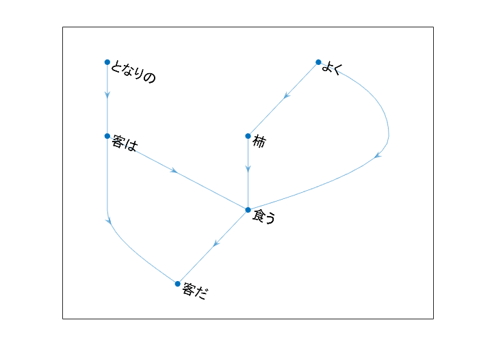
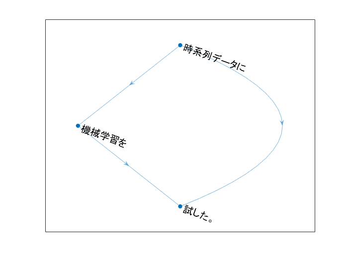
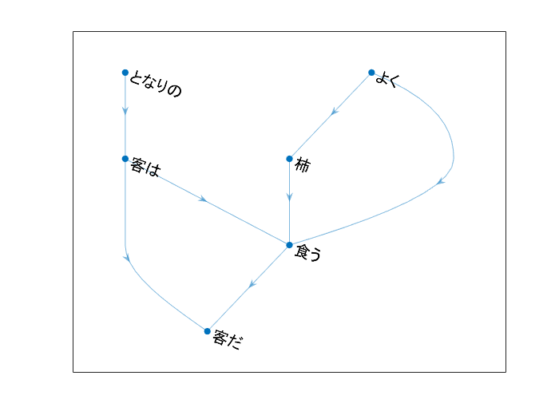
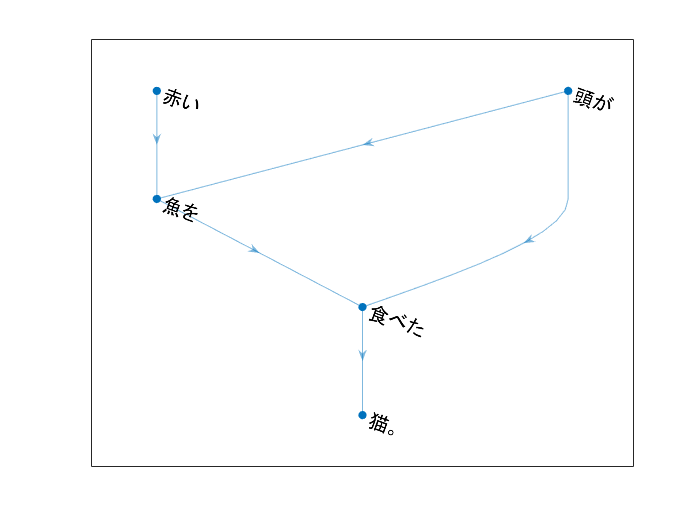

# 形態素解析
  
# はじめに


COTOHA API を使った面白い投稿がでていますね。そんな皆さんの記事を楽しみながら地味に遊んでいるわけですが、今回は基本に立ち戻って構文解析（形態素解析）を確認してみます。要点は以下の３点です


  

   -  *ポイント１：自然言語を取り扱う際に使用する辞書は重要* 
   -  *ポイント２：*辞書の追加方法 
   -  *ポイント３*：COTOHA API による構文*可視化* 





## 環境

   -  MATLAB R2019b 
   -  Text Analytics Toolbox 
   -  COTOHA API v1 

  
# 形態素解析って？
  
> **形態素解析**（けいたいそかいせき、*Morphological Analysis*）とは、文法的な情報の注記の無い[自然言語](https://ja.wikipedia.org/wiki/%E8%87%AA%E7%84%B6%E8%A8%80%E8%AA%9E)のテキストデータ（[文](https://ja.wikipedia.org/wiki/%E6%96%87)）から、対象言語の[文法](https://ja.wikipedia.org/wiki/%E6%96%87%E6%B3%95)や、**辞書**と呼ばれる[単語](https://ja.wikipedia.org/wiki/%E8%AA%9E)の品詞等の情報にもとづき、[形態素](https://ja.wikipedia.org/wiki/%E5%BD%A2%E6%85%8B%E7%B4%A0)（*Morpheme*, おおまかにいえば、[言語](https://ja.wikipedia.org/wiki/%E8%A8%80%E8%AA%9E)で意味を持つ最小単位）の列に分割し、それぞれの形態素の[品詞](https://ja.wikipedia.org/wiki/%E5%93%81%E8%A9%9E)等を判別する作業である。（[Wikipedia](https://ja.wikipedia.org/wiki/%E5%BD%A2%E6%85%8B%E7%B4%A0%E8%A7%A3%E6%9E%90)）


  


ということで自然言語処理では欠かせない作業のようです。例えば MATLAB では [MeCab](https://ja.wikipedia.org/wiki/MeCab) が使用されており、`tokenizedDocument` 関数で実行します。


```matlab
str = "時系列データに機械学習を試した。";
documents = tokenizedDocument(str);
tokenDetails(documents)
```
| |Token|DocumentNumber|LineNumber|Type|Language|PartOfSpeech|Lemma|Entity|
|:--:|:--:|:--:|:--:|:--:|:--:|:--:|:--:|:--:|
|1|"時"|1|1|letters|ja|noun|"時"|non-entity|
|2|"系列"|1|1|letters|ja|noun|"系列"|non-entity|
|3|"データ"|1|1|letters|ja|noun|"データ"|non-entity|
|4|"に"|1|1|letters|ja|adposition|"に"|non-entity|
|5|"機械"|1|1|letters|ja|noun|"機械"|non-entity|
|6|"学習"|1|1|letters|ja|noun|"学習"|non-entity|
|7|"を"|1|1|letters|ja|adposition|"を"|non-entity|
|8|"試し"|1|1|letters|ja|verb|"試す"|non-entity|
|9|"た"|1|1|letters|ja|auxiliary-verb|"た"|non-entity|
|10|"。"|1|1|punctuation|ja|punctuation|"。"|non-entity|


こんな具合です。


  
## 「時系列データ」=>「時」「系列」「データ」


 「時系列」が「時」「系列」に、「機械学習」が「機械」「学習」と分割されているのが気になります。これは MeCab で使用する辞書（既定： IPADIC）にその単語が入っていないことが要因だと推測しますが、そもそも形態素解析とは合成語を個別に認識する用途ではないのかもしれない。


この辺が分解されてしまった形態素をそのまま使うと、文章のトピック分析やキーワード抽出に影響を与えることになりそうです。技術関係の単語が多い、例えば Qiita の投稿記事を分析しようとするとちょっと心配。


例えばこの例：[Word-By-Word Text Generation Using Deep Learning](https://jp.mathworks.com/help/textanalytics/ug/word-by-word-text-generation-using-deep-learning.html) では LSTM を使って（英語）文章生成しています。同じ方法をそのまま細かく分解されてしまった日本語に使うと英語程の結果が出ない気がしますね。[形態素解析をして単語を取り出せているつもり・・・か？](https://qiita.com/icoxfog417/items/e83383263badec7a4805) by @icoxfog417 でおっしゃっているような「形態素解析」と「単語」だと、「単語」を使用すべきでしょう。


*こんな複合語については「*[形態素解析での効率的な複合語処理](https://ci.nii.ac.jp/naid/110002911631)（青木和夫 著 - ��2003）*」などいろんなお話があります。*


  
# COTOHA API では？


やってみます。ちなみに COTOHA API 提供する「構文解析 API 」では形態素に分解するだけでなく、文節間の係り受け関係や形態素間の係り受け関係まで出してくれます。


  
### アクセストークン設定


`clientid` と `clientsecret` はご自身のものを指定ください。


```matlab
clientid = 'input_your_Client_ID';
clientsecret = 'input_your_Client_secret';

url = 'https://api.ce-cotoha.com/v1/oauth/accesstokens';
options = weboptions('RequestMethod','post', 'MediaType','application/json');
Body = struct('grantType', 'client_credentials', ...
    'clientId', clientid, ...
    'clientSecret', clientsecret);
tokens = webwrite(url, Body, options);
```
### 構文解析 API


呼び出します。


```matlab
baseurl = 'https://api.ce-cotoha.com/api/dev/';
accesstoken = tokens.access_token;
Header = {'Content-Type', 'application/json;charset=UTF-8'; 'Authorization', ['Bearer ' accesstoken]};
Body = struct('sentence', "時系列データに機械学習を試した。", ...
    'type', 'default');

options = weboptions('RequestMethod','post', 'MediaType','application/json','HeaderFields', Header);
response = webwrite([baseurl 'nlp/v1/parse'], Body, options);
```
  
### トークンだけ抽出


結果は入り組んだ構造体で返ってきていろんな情報が入っています（詳細：[構文解析 API](https://api.ce-cotoha.com/contents/reference/apireference.html#parsing_io_meaning)）。私の知識ではすべてを使いこなせないので、ここでは表記（form）とその単語の出現順、そして文節（chunk）の情報を取り出します。関数作っておきました（ページ下部）ので興味のある方は見てください。


```matlab
[listofToken, chunkList] = getTokens(response);
listofToken
```
| |chunkIDs|IDs|forms|
|:--:|:--:|:--:|:--:|
|1|1|0|"時系列"|
|2|1|1|"データ"|
|3|1|2|"に"|
|4|2|3|"機械"|
|5|2|4|"学習"|
|6|2|5|"を"|
|7|3|6|"試"|
|8|3|7|"し"|
|9|3|8|"た"|
|10|3|9|"。"|


こんな具合。機械学習は「機械」と「学習」ですが、「時系列」は認識されているみたいです。


COTOHA API の Enterprise ユーザのみですが、解析に使用する専門用語辞書も別途指定可能。11種類もあるので特定の分野に特化した文章の場合は使わない手はなさそうですね。


  
### 文節間の係り受け関係


ついでに文のつながりも見てみます。`digraph` 関数を使って有向グラフで表示します。


各分節を 1 つのノードと考えることにして、各分節に属する単語同士を `join` 関数で繋げるて各ノードのラベルとします。


```matlab
nodelabels = splitapply(@(x) join(x,""),listofToken.forms,listofToken.chunkIDs); % 同じ chunkID の forms は結合
g = digraph(chunkList,nodelabels,'omitselfloops');
plot(g,'Layout','layered','NodeFontSize',12);
```




構成が見えました。これは遊びがいがありそうなので他の例もページ下部で紹介します。


# トランプ問題：固有名詞


もう１つ。


```matlab
str = "ドナルド・トランプがマクドナルドでトランプを";
Body = struct('sentence',str, 'type', 'default');
response = webwrite([baseurl 'nlp/v1/parse'], Body, options);
getTokens(response)
```
| |chunkIDs|IDs|forms|
|:--:|:--:|:--:|:--:|
|1|1|0|"ドナルド・トランプ"|
|2|1|1|"が"|
|3|2|2|"マクドナルド"|
|4|2|3|"で"|
|5|3|4|"トランプ"|
|6|3|5|"を"|


COTOHA API はトランプさんを認識してますね。ちなみに MeCab とデフォルトの辞書（IPADIC）を使うと


```matlab
documents = tokenizedDocument(str);
tokenDetails(documents)
```
| |Token|DocumentNumber|LineNumber|Type|Language|PartOfSpeech|Lemma|Entity|
|:--:|:--:|:--:|:--:|:--:|:--:|:--:|:--:|:--:|
|1|"ドナルド"|1|1|letters|ja|proper-noun|"ドナルド"|person|
|2|"・"|1|1|punctuation|ja|symbol|"・"|non-entity|
|3|"トランプ"|1|1|letters|ja|noun|"トランプ"|non-entity|
|4|"が"|1|1|letters|ja|adposition|"が"|non-entity|
|5|"マクドナルド"|1|1|letters|ja|proper-noun|"マクドナルド"|organization|
|6|"で"|1|1|letters|ja|adposition|"で"|non-entity|
|7|"トランプ"|1|1|letters|ja|noun|"トランプ"|non-entity|
|8|"を"|1|1|letters|ja|adposition|"を"|non-entity|


これだと（ドナルド・）トランプとトランプが同じ情報になっちゃっています。


これはわざとらしい例ですが、この辺の前処理が最終結果に与える影響は大きいので、前処理はめんどくさがらずにしっかりやらんとイケナイという教訓ですね。


# 対策１：CustomTokens オプション


合成語として対応が必要な用語が少しでであれば `CustomTokens` オプションを使う手もあります。


```matlab
documents = tokenizedDocument(str,"CustomTokens","ドナルド・トランプ");
tokenDetails(documents)
```
| |Token|DocumentNumber|LineNumber|Type|Language|PartOfSpeech|Lemma|Entity|
|:--:|:--:|:--:|:--:|:--:|:--:|:--:|:--:|:--:|
|1|"ドナルド・トランプ"|1|1|custom|ja|other|"ドナルド・トランプ"|non-entity|
|2|"が"|1|1|letters|ja|adposition|"が"|non-entity|
|3|"マクドナルド"|1|1|letters|ja|proper-noun|"マクドナルド"|organization|
|4|"で"|1|1|letters|ja|adposition|"で"|non-entity|
|5|"トランプ"|1|1|letters|ja|noun|"トランプ"|non-entity|
|6|"を"|1|1|letters|ja|adposition|"を"|non-entity|


不明な単語として認識されちゃいますが、少なくともトランプとの誤認識は避けられます。


# 対策２：辞書の追加


少しだけの特別対応であれば上での方法でいいかもしれませんが、沢山ある場合にはデフォルトで使用する  IPADIC に加えて IPADIC に追加の辞書を与えてやる方がよさそうです。 


選択肢は２つ：


   1.  自分で１から作る：大変だけどニッチな分野の文章が対象であればしょうがない・・。 
   1.  公開されている辞書を使う：ぴったり合った辞書があればいいんだけど。 


例えば


   -  医療分野： [ComeJisyo](https://ja.osdn.net/projects/comedic/)（コメディカル実践用）, [MANBYO](http://sociocom.jp/~data/2018-manbyo/index.html)（病名や症状） 
   -  科学技術全般（？）: [科学技術用語形態素解析辞書](https://dbarchive.biosciencedbc.jp/jp/mecab/desc.html) (CC バイオサイエンスデータベースセンター CC BY-SA 4.0) 


などが見つかりました。ComeJisyo は昔、医療文章の解析に使ったことがあります。参考：[UbuntuでMeCabに医療用語辞書(ComeJisyo,MANBYO)を追加してみた](https://qiita.com/yama_ebi/items/73ed13b43ace1a3e5606) by @yama_ebi さん


  


あとは [mecab-ipadic-NEologd](https://github.com/neologd/mecab-ipadic-neologd/blob/master/README.ja.md) には大変興味をひかれました。


> mecab-ipadic-NEologd は形態素解析エンジン MeCab と共に使う単語分かち書き辞書で、週2回以上更新され、新語・固有表現に強く、語彙数が多く、しかもオープンソース・ソフトウェアである という特徴があります。（[新語・固有表現に強い「mecab-ipadic-NEologd」の効果を調べてみた](https://engineering.linecorp.com/ja/blog/mecab-ipadic-neologd-new-words-and-expressions/)）


週2回以上更新とか、新語対応への気合の入りようが他とは一線を画します。どう実現しているんだ・・。リンク先を見ると新語への対応（テレビ番組名、固有名詞など）は素晴らしい模様です。


# MATLAB で使えるのか？


それぞれの使用例はまた機会があれば纏めたいと思いますが、基本的に


```matlab
mecabOptions
```
```
ans = 
  MecabOptions のプロパティ:

             Model: "C:\Program Files\MATLAB\R2019b\sys\share\dict-ipadic"
         UserModel: ""
    LemmaExtractor: @textanalytics.ja.mecabToLemma
      POSExtractor: @textanalytics.ja.mecabToPOS
      NERExtractor: @textanalytics.ja.mecabToNER

```


この `UserModel` に辞書 dic ファイルのパスを設定するだけでOKです。


ここでは結果だけにしますが、上で触れた [JSTシソーラス見出し語・同義語辞書](https://dbarchive.biosciencedbc.jp/jp/mecab/data-1.html) （科学技術用語形態素解析辞書）を使ってみると


```matlab
% Thesaurus2015.dic は上のリンク先から別途ダウンロードしてください
mOptions = mecabOptions('UserModel',"Thesaurus2015.dic");
str = "時系列データに機械学習を試した。";
documents = tokenizedDocument(str,"TokenizeMethod",mOptions);
tokenDetails(documents)
```
| |Token|DocumentNumber|LineNumber|Type|Language|PartOfSpeech|Lemma|Entity|
|:--:|:--:|:--:|:--:|:--:|:--:|:--:|:--:|:--:|
|1|"時系列"|1|1|letters|ja|noun|"時系列"|non-entity|
|2|"データ"|1|1|letters|ja|noun|"データ"|non-entity|
|3|"に"|1|1|letters|ja|adposition|"に"|non-entity|
|4|"機械学習"|1|1|letters|ja|noun|"機械学習"|non-entity|
|5|"を"|1|1|letters|ja|adposition|"を"|non-entity|
|6|"試し"|1|1|letters|ja|verb|"試す"|non-entity|
|7|"た"|1|1|letters|ja|auxiliary-verb|"た"|non-entity|
|8|"。"|1|1|punctuation|ja|punctuation|"。"|non-entity|


こんどは「時系列」と「機械学習」がそれぞれ単語として認識されています。これはよさげ。


この例のように `dic` ファイルが公開されているものもあれば、別のファイル（csv 等）から dic ファイルを作る必要がある場合もあります。


  
# まとめ


今回は辞書と形態素解析の結果について触れてみました。ただ闇雲に文章を分解してモデルに入れてもいいことにはならなそう。新語や固有名詞に強そうな [mecab-ipadic-NEologd](https://github.com/neologd/mecab-ipadic-neologd/blob/master/README.ja.md) は面白そうなので、是非使ってみてまとめてみたいと思います。（できるかな）


COTOHA API で用意されている辞書の真価は Enterprise ユーザーになれば堪能できるようですが、そもそも形態素解析以上の機能がもり沢山なので、あまり大きな問題ではないですね。


  
# おまけ：文節の係り受け可視化


COTOHA API の構文解析 API の結果には各単語の依存関係だけでなく、文節の係り受け情報も含まれています。ここでは文節間のつながりを見てみましょう。


## となりの客はよく柿食う客だ
```matlab
str = "となりの客はよく柿食う客だ";
Body = struct('sentence', str, 'type', 'default');

options = weboptions('RequestMethod','post', 'MediaType','application/json','HeaderFields', Header);
response = webwrite([baseurl 'nlp/v1/parse'], Body, options);

% 表記、文節情報の抽出
[listofToken, chunkList] = getTokens(response);

% 同じ chunkID の forms は結合してノード名に
nodelabels = splitapply(@(x) join(x,""),listofToken.forms,listofToken.chunkIDs);  
g = digraph(chunkList,nodelabels,'omitselfloops');
plot(g,'Layout','layered','NodeFontSize',12);
```




自然言語的にどれくらい意義があるか分かりませんが、どのルートを取っても文として成立していますね。


   -  となりの客は食う客だ 
   -  となりの客は客だ 
   -  よく食う客だ 
   -  よく柿食う客だ 

## 頭が赤い魚を食べた猫


いろんな解釈の可能性がある文。詳細はこちら「[たくさんの解釈ができる「頭が赤い魚を食べた猫」が面白い](https://nihongonosensei.net/?p=7442)」。各解釈別に絵が付いているので面白いです。COTOHA API ではどんな理解をするんでしょうか・・。


```matlab
str = "頭が赤い魚を食べた猫。";
Body = struct('sentence', str, 'type', 'default');

options = weboptions('RequestMethod','post', 'MediaType','application/json','HeaderFields', Header);
response = webwrite([baseurl 'nlp/v1/parse'], Body, options);

% 表記、文節情報の抽出
[listofToken, chunkList] = getTokens(response);

% 同じ chunkID の forms は結合してノード名に
nodelabels = splitapply(@(x) join(x,""),listofToken.forms,listofToken.chunkIDs);
g = digraph(chunkList,nodelabels,'omitselfloops');
plot(g,'Layout','layered','NodeFontSize',12);
```




   -  赤い魚を食べた猫 
   -  頭が食べた猫 
   -  頭が魚を食べた猫 


現実的なのは「**頭が赤い魚**を食べた猫」でしょうが・・。


> 日本語は文節で順番を入れ替えられるので、修飾節と被修飾節に距離があっても正しい日本語として認識できます。ただし、話者の意図したことを正しく理解できるかどうかは**文脈次第**、場合によっては運次第です。（[たくさんの解釈ができる「頭が赤い魚を食べた猫」が面白い](https://nihongonosensei.net/?p=7442)）


難しいですね。面白そうな文章があればぜひ試してみてください。


# Appendix: getTokens 関数
```matlab
function [listofTokens, chunkLinks] = getTokens(response)
% COTOHA API: Parse の結果から 
% 1: chunk（文節）の係り受け関係と
% 2: 各 token （形態素）のform （表記）を取り出す関数 

rsize = length(response.result);
chunkIDs = [];
IDs = [];
forms = [];
% chunkLinks は隣接行列として取り出して digraph で可視化します。
% 詳細：https://jp.mathworks.com/help/matlab/ref/digraph.html
chunkLinks = zeros(rsize);

% chunk ごとに構造体として情報が確保されているため
% 1つづつ処理していきます。
for ii = 1:rsize
    % 1 chunk 分
    tmp = response.result(ii);

    % その chunk "が"かかっている chunkID
    head = response.result(ii).chunk_info.head;
    if head > 1 % 文末は -1 ：無視
        chunkLinks(ii,head) = 1; % 
    end
    % その chunk "に"かかっている chunkID
    links = response.result(ii).chunk_info.links;
    if ~isempty(links) % かかっていない場合もある
        linkorigins = [links.link]+1;
        chunkLinks(linkorigins,ii) = 1;
    end
    
    % chunk 内の形態素 token を順次処理
    csize = length(tmp.tokens); % token の数
    chunkIDs = [chunkIDs; repmat(ii,csize,1)]; % 同じ chunkID を複製
    
    if csize == 1 
        % token が1つの場合は構造体データ
        IDs = [IDs; tmp.tokens.id];
        forms = [forms; string(tmp.tokens.form)];

    else   
        % token が2つ以上の場合は構造体が cell 配列に入っています。
        IDs = [IDs; cellfun(@(x) x.id, tmp.tokens)];
        tmp = cellfun(@(x) x.form, tmp.tokens, 'UniformOutput', false);
        forms = [forms; string(tmp)];
        % 参考：上と同じ処理を for ループで書いた場合
        %  for jj = 1:csize 
        %      chunkIDs = [chunkIDs; ii];
        %      IDs = [IDs; tmp.tokens{jj}.id];
        %      forms = [forms; string(tmp.tokens{jj}.form)];
        %  end
    end
end

listofTokens = table(chunkIDs, IDs, forms);

end
```
