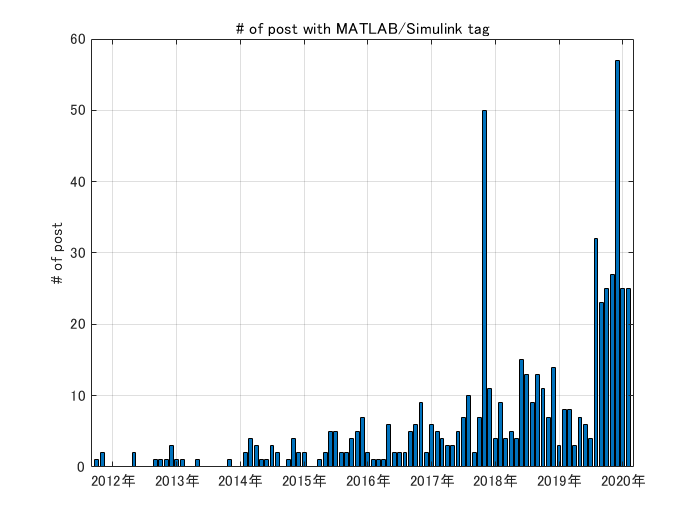
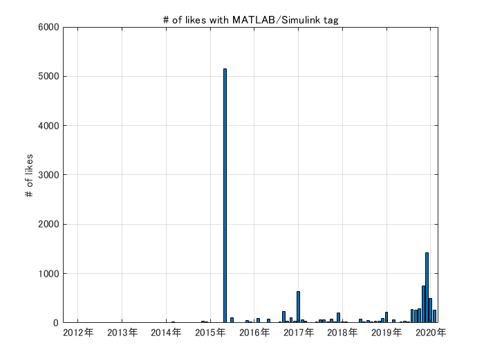

# はじめに
  


今回は「いそがしい MATLAB ユーザー向け Qiita 振返り」作成記です。


最近 MATLAB タグのついた記事が増えてきているように思いますので、Qiita API を使って集計してみます。そして前回（[【COTOHA API x MATLAB】Qiita 投稿記事の要約](https://qiita.com/eigs/items/39196afdb5f28bf3ba0f)）に引き続き COTOHA API （詳細：[COTOHA API Portal](https://api.ce-cotoha.com/contents/index.html)）の要約機能を使って少し遊んでみましょう。


  
## 実行環境

   -  MATLAB R2019b 
   -  Text Analytics Toolbox 

## やったこと

   -  Qiita API で `matlab` と `simulink` のタグが付いた記事を抽出 
   -  いいね順に並べて COTOHA API で要約作成 
   -  2018 年 まとめ：[忙しい MATLAB ユーザー向け Qiita ふり返り（2019年版）](https://qiita.com/eigs/private/34c623399298d54453ce) 
   -  2019 年 まとめ：[忙しい MATLAB ユーザー向け Qiita ふり返り（2018年版）](https://qiita.com/eigs/private/a75f816a9ad2b75466b6) 


`timetable` 型のデータを `retime` 関数で集計するところ、そして構造体ベクトルの入ったセル配列ベクトル（！？）の処理などが、マニアックで見どころです。また、約 5000 文字を超える文章については COTOHA API からエラーが返ってきちゃったので、その辺ざっくり打ち切っていますのでご了承ください。


# Qiita API で MATLAB/Simulink の記事取得


早速作業に取り掛かります。


```matlab
clear
loadFlag = true;

if loadFlag % 読み込まない場合は事前読み込み済みのデータを mat ファイルから読み込みます
    % アクセストークン使用（自分の token に書き換えてください）
%     accessToken = 'Bearer xxxxxxxxxxxxxxxxxxxxxxxxxxxxxxxxxxxxxxxx';
%     opts = weboptions('HeaderFields',{'Authorization',accessToken});
    opts = weboptions; % 制限内だったらこれだけでもOK
    
    % 全件取っても 600 記事なので特に細工は必要なさそう。
    page = 1;
    data = [];
    tags = ["matlab","simulink"];
    for tagid=1:2
        page = 1;
        while true
            url = "https://qiita.com/api/v2/tags/" + tags(tagid) + "/items?page="+page+"&per_page=100";
            tmp = webread(url,opts);
            if isempty(tmp)
                break;
            end
            data = [data;tmp]; %#ok<AGROW>
            page = page + 1;
        end
    end
    
    % 構造体で得られるので table 型に変換
    data = struct2table(data);
    
    % 一応重複が無いかだけチェック
    [~,ia,~] = unique(data.id);
    data = data(ia,:);
    save('allArticles.mat','data')
else
    load allArticles.mat %#ok<UNRCH>
end
```
  


ちなみにこの時点で変数は 18 個。


```matlab
data.Properties.VariableNames'
```
```
ans = 16x1 の cell 配列    
'rendered_body'      
'body'               
'coediting'          
'comments_count'     
'created_at'         
'group'              
'id'                 
'likes_count'        
'private'            
'reactions_count'    

```


とりあえず、投稿日、記事のタイトル、記事の内容、ユーザー名、いいね数、タグ詳細、URL だけを残しておきます。


```matlab
data = data(:,{'created_at', 'title','rendered_body','user','likes_count','tags','url'});
head(data)
```
| |created_at|title|rendered_body|user|likes_count|tags|url|
|:--:|:--:|:--:|:--:|:--:|:--:|:--:|:--:|
|1|'2018-05-05T23:01:26+09:00'|'時系列データ分析の書籍のサンプルデータをMATLABで試してみた'|


こんな感じ。


# timetable 型に変換など、こまごましたところ


投稿時刻が 2020-02-08T19:10:45+09:00 というようなフォーマットなので、それに合わせて `datetime` 型に変換、そして `timetable` 型に変換しておきます。


```matlab
created_at = datetime(vertcat(data.created_at),...
    'InputFormat', "uuuu-MM-dd'T'HH:mm:ss'+09:00");
tData = table2timetable(data,'RowTimes', created_at);
```


文字列関係はすべて string 型にしておきます。ユーザー名については他にも沢山情報が詰まった構造体になっているのですが、ここでは id だけを取り出しておきます。


## url (文字列 in セル配列）


これは簡単


```matlab
tData.url = string(tData.url);
```


tData.url は cell 配列になっているので、そのまま string 型にサクッと変更されます。title と rendered_body も同様です。


```matlab
tData.title = string(tData.title);
tData.rendered_body = string(tData.rendered_body);
```
## user (構造体）


構造体はちょっと面倒。欲しいのは user の中の id というメンバーだけ。冒頭だけのぞいてみると


```matlab
tData.user(1:2).id
```
```
ans = 'Alberobellojiro'
ans = 'nHounoki'
```


という「コンマ区切りリスト」になります。


これは、同じサイズのデータであれば `[]` (`vertcat` or `horzcat`) でベクトル化、もしくは `{}` で囲めば cell 配列として処理できます。慣れるとどうってことないのですが、結構取り扱いに困った記憶がよみがえりますね。


ここでは id はいろんな長さの文字列のようなので、cell 配列に変換した上で `string` にかけてみます。


```matlab
tmp = {tData.user.id}';
tmp(1:2)
```
```
ans = 2x1 の cell 配列    
'Alberobellojiro'    
'nHounoki'           

```
```matlab
tData.user = string(tmp);
```
## tag (構造体s in セル配列）


これはまた少し面倒くさい。セル配列の中に構造体が（複数）入っています。例えば


```matlab
tData.tags{1}
```
|フィールド|name|versions|
|:--:|:--:|:--:|
|1|'R'|[ ]|
|2|'matlab'|[ ]|


こんな感じ。欲しいのは name だけなんですが、


```matlab
{tData.tags{1}.name}
```
```
ans = 1x2 の cell 配列    
'R'          'matlab'     

```


という手も全行一気に処理するには使えそうにない・・のでここは潔く諦めて cellfun で行ってみます。


```matlab
tmp = tData.tags; % cell 配列
cellfun(@(x) string({x.name}), tmp);
```
```
エラー: cellfun
Uniform の出力のインデックス 1 にある出力 1 がスカラーでありません。
'UniformOutput' を false に設定してください。
```


それぞれのセル配列の中身の構造体から name フィールド取ってきて、いったんセル配列にした上で string 化する、という処理しているんですが、UniformOutput じゃないと怒られます。要は記事ごとに tag の数が違うので、連結できませんという意味です。そらそうだ。


ここはエラーメッセージに従ってオプションを付けて、セル配列として出力しておきます。


```matlab
tData.tags = cellfun(@(x) string({x.name}), tmp, 'UniformOutput', false);
tData.tags(1:2)
```
| |1|
|:--:|:--:|
|1|1x2 string|
|2|1x3 string|

```matlab
tData.tags{1}
```
```
ans = 1x2 の string 配列    
"R"          "matlab"     

```


こんな感じ。


  
# 月間投稿数推移


ここでようやくひと段落・・。


セルやら構造体やら構造体のベクトルやら面倒でしたが、ひとまずまとまったので月間投稿数の推移でも見てみます。ここは個人的にお気に入りの（しらんがな） `retime` 関数の出番です。


```matlab
tmp = retime(tData(:,'title'),'monthly','count');
bar(tmp.Time,tmp.title)
title('# of post with MATLAB/Simulink tag')
ylabel('# of post')
grid on
```




Qiita 全体の活性化に引っ張られてか MATLAB 関連記事投稿数も少しづつ伸びてきていますが、昨年後半に大きく伸びていますね。


## 月間いいね総数


ついでに。今度は記事のカウントではなく、いいねの総数なので `'count`' を `'sum'` に変えておきます。


```matlab
tmp = retime(tData(:,"likes_count"),'monthly','sum');
bar(tmp.Time,tmp.likes_count)
title('# of likes with MATLAB/Simulink tag')
ylabel('# of likes')
grid on
```




2015 年に大きな異常値（？）がありますね。2019 年後半も健闘しているんですが、かき消されてしまっていますね・・。5000 越えはすごい。


この記事です：[数学を避けてきた社会人プログラマが機械学習の勉強を始める際の最短経路](https://qiita.com/daxanya1/items/218f2e3b922142550ef9)


  


`'monthly'` のところを `'yearly'` にすれば年間、`'weekly'` にすれば週間、`'secondly'` にすれば毎秒ごとの集計が取れる優れもの。他にも使いどころあると思うので、詳細は[ retime 関数のヘルプページ](https://jp.mathworks.com/help/matlab/ref/timetable.retime.html)を見てください


  
# さて本題の要約


2018年、2019年に投稿された記事のいいねトップ50について 2 文で要約してもらいます。


COTOHA API を使う部分は前回（[【COTOHA API x MATLAB】Qiita 投稿記事の要約](https://qiita.com/eigs/items/39196afdb5f28bf3ba0f)）と同じですが、記事の長さが 5000 文字を超えるとエラーが出る現象に見舞られたので、5000文字を超える大作記事については、ざっくり前半の2500文字、後半の2500文字を使います。


## **アクセストークンを取得する**


`clientid` と `clientsecret` は適宜書き換えてください。


```matlab
clientid = 'input_your_Client_ID';
clientsecret = 'input_your_Client_secret';

url = 'https://api.ce-cotoha.com/v1/oauth/accesstokens';
options = weboptions('RequestMethod','post', 'MediaType','application/json');
Body = struct('grantType', 'client_credentials', ...
    'clientId', clientid, ...
    'clientSecret', clientsecret);
tokens = webwrite(url, Body, options);
```
## 2019年まとめ（いいね順）


2019 年の記事を取り出して、いいね順に並べ替えて上から50記事について要約をしてもらいます。


```matlab
trange = timerange(datetime(2019,1,1),datetime(2020,1,1));
tData2019 = tData(trange,:);
tData2019 = sortrows(tData2019,'likes_count','descend');
```


COTOHA で ２ 文に要約。


```matlab
COTOHAsummary = strings(height(tData2019),1);
for ii=1:50
    COTOHAsummary(ii) = getSummary(tData2019.rendered_body(ii),tokens,2);
end
tData2019.COTOHAsummary = COTOHAsummary;
```


Markdown で書き出して後で Qiita にコピペ。


```matlab
md = generateMarkdown(tData2019, "# 2019 まとめ");

mdfile = "Qiita2019" + ".md";
fileID = fopen(mdfile,'w');
fprintf(fileID,'%s\n',md);
fclose(fileID);

```
## 2018年まとめ（いいね順）


2018 年の記事を取り出して、いいね順に並べ替えて上から50記事について要約をしてもらいます。


```matlab
trange = timerange(datetime(2018,1,1),datetime(2019,1,1));
tData2018 = tData(trange,:);
tData2018 = sortrows(tData2018,'likes_count','descend');
```


COTOHA で 2 文に要約。


```matlab
COTOHAsummary = strings(height(tData2018),1);
for ii=1:50
    COTOHAsummary(ii) = getSummary(tData2018.rendered_body(ii),tokens,2);
end
tData2018.COTOHAsummary = COTOHAsummary;
```


Markdown で書き出して後で Qiita にコピペ。


```matlab
md = generateMarkdown(tData2018, "# 2018 まとめ");

mdfile = "Qiita2018" + ".md";
fileID = fopen(mdfile,'w');
fprintf(fileID,'%s\n',md);
fclose(fileID);
```
# まとめ


Qiita API ではレンダリングされた記事とは別に 'body' で、markdown バージョンも取り出せますが、文字抽出作業には html の方が楽でした。


数式・コード部分はざっくり取り除いて処理をしましたが、タイトル＋要約である程度中身も想像がつきますね。大量の記事をざっくり把握して読むものを選ぶという用途にはよさそうな気がしてきました。


  


[忙しい MATLAB ユーザー向け Qiita ふり返り（2018年版）](https://qiita.com/eigs/private/34c623399298d54453ce)


[忙しい MATLAB ユーザー向け Qiita ふり返り（2019年版）](https://qiita.com/eigs/private/a75f816a9ad2b75466b6)


  


COTOHA API を試してみたい！という方のお役に立てたら嬉しいです。


# Appendix
## getSummary 関数
```matlab
function summary = getSummary(htmlSource, tokens, sent_len)

tree = htmlTree(htmlSource);

selector = "h1,h2,h3,p,li";
subtrees = findElement(tree,selector);

% check if details contained in p
index = false(length(subtrees),1);
for ii=1:length(subtrees)
    tmp = findElement(subtrees(ii),'details');
    index(ii) = isempty(tmp); % <DETAILS> があれば false になる
end

% DETAILS 無しの P, LI だけ
subtreesNoDetails = subtrees(index);

% 入力文
sentence = extractHTMLText(subtreesNoDetails);

sentence = join(sentence);
if strlength(sentence) > 5000
    tmp = char(sentence);
    sentence = string(tmp([1:2500,end-2499:end]));
end
strlength(sentence);

% Call COTOHA API
baseurl = 'https://api.ce-cotoha.com/api/dev/';
accesstoken = tokens.access_token;
Header = {'Content-Type', 'application/json;charset=UTF-8'; 'Authorization', ['Bearer ' accesstoken]};
Body = struct('document', sentence, ...
    'sent_len', num2str(sent_len));
options = weboptions('RequestMethod','post', 'MediaType','application/json','HeaderFields', Header);

response = webwrite([baseurl 'nlp/beta/summary'], Body, options);
summary = string(response.result);

end
```
## generateMarkdown 関数
```matlab
function md = generateMarkdown(tData, header)

md = header + newline + newline;
for ii=1:50
    title = tData.title(ii);
    url = tData.url(ii);
    md = md + "## " + ii + ": [" + title + "]("+url+")" + newline;
    likes = tData.likes_count(ii);
    user = tData.user(ii);
    date = tData.Time(ii);
    date.Format = 'yyyy/MM/dd';
    
    md = md + "@" + user + " さん (" ...
        + string(date) + " 投稿)" + ": **" + string(likes) + "**" + " いいね" ...
        + newline;
    
    tags = tData.tags{ii};
    tags = "```" + tags + "```";
    md = md + "**Tags** :" + join(tags) + newline;
    
    summary = tData.COTOHAsummary(ii);
    if strlength(summary) > 150 % 長い要約は打ち切っちゃいます。
        tmp = char(summary);
        summary = string(tmp(1:150)) + "...(中略)";
    end
    md = md + newline + ...
        "> " + summary + newline + newline;
    
end

end
```
